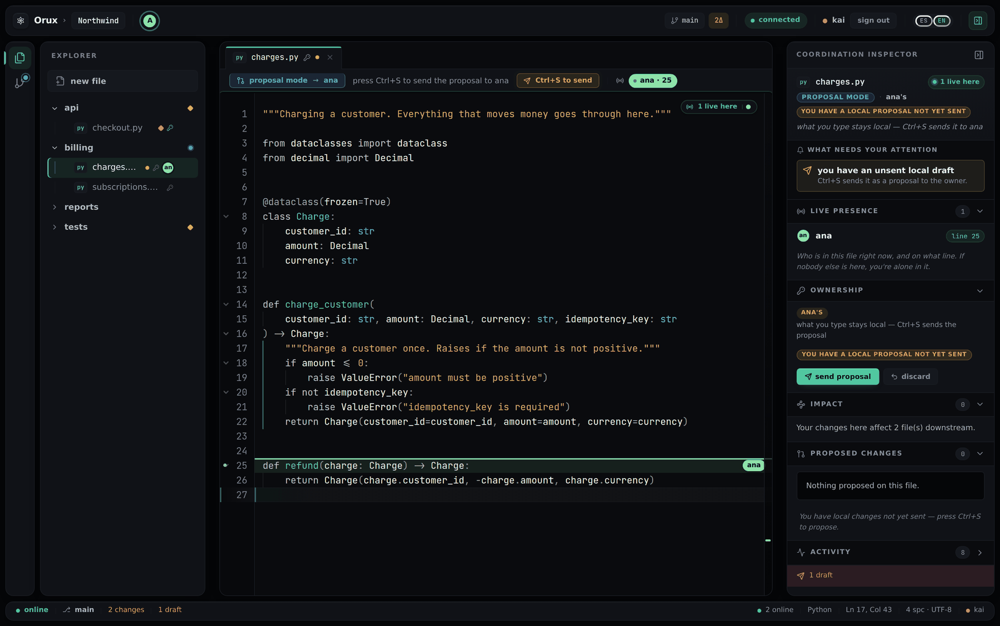
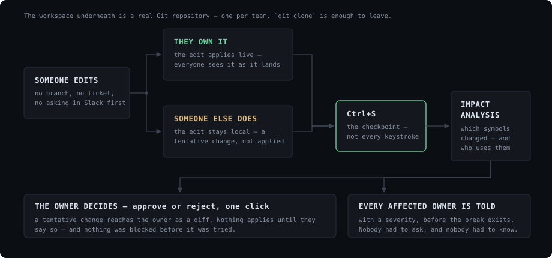
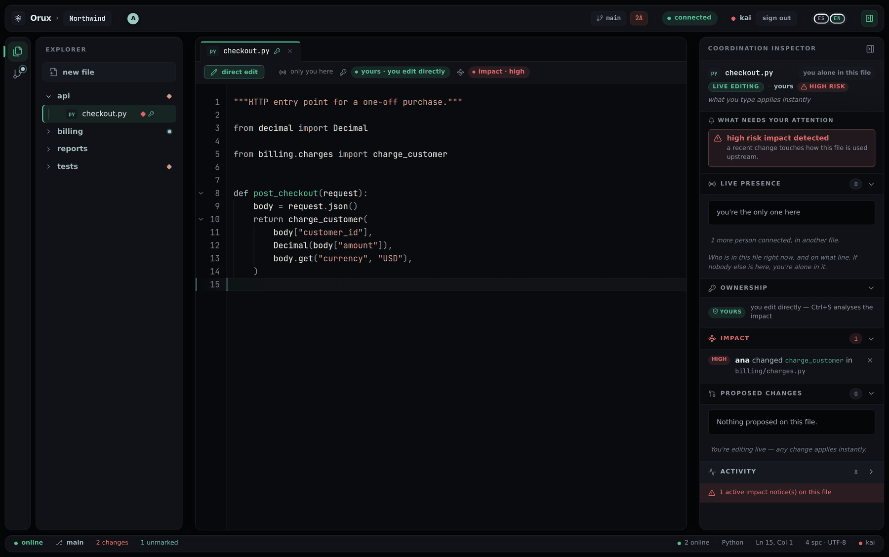
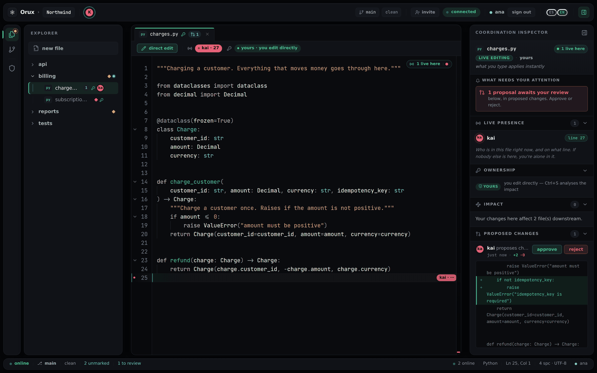

# Orux

A coordination layer for small teams working on the same Git repository.
Presence down to the line, ownership that decides what an edit means, tentative
changes that reach the owner as a diff, and a semantic impact analysis that
warns the people whose code is about to break — before it breaks.

> [!NOTE]
> **Orux is no longer running.** It reached production at `orux.space` and was
> shut down; the service is gone and is not accepting sign-ups. This repository
> is the finished product, kept as an engineering record. Everything in it still
> runs locally — the quick start below is how the screenshots on this page were
> taken.



<sup>Kai edits a file Ana owns. Nothing was blocked — the change is simply
*tentative* until Ana sees it. Ana's cursor is live on line 25.</sup>

---

## The problem it goes after

Git understands files, lines, commits and branches. Teams work with
responsibilities, dependencies, contracts and human coordination. Branches, PRs
and reviews were designed for scale; for a team of two to fifty they are
microservices in a demo — they work, and the friction is out of all proportion
to the benefit.

So people route around them, and pay for it in a specific and boring way:

- "I had to open a branch to change two lines."
- "I didn't know someone was already in that file, and now there's a conflict."
- "I broke something in another module without noticing."
- "I had to ask in Slack whether I could touch that file."

And the tech lead becomes the bottleneck, because they are the only person with
the whole picture in their head.

**Orux's bet:** the same safety as branches, PRs and reviews, without the
ceremony — because the system already knows what everyone else is doing, and
nobody had to ask it.

## How a change actually moves



Three things make that work, and they are the whole product.

### 1 — Ownership decides what an edit *means*, not whether you may make it

Every file, and every symbol in it, can have an owner. If it is yours, what you
type applies live and everyone sees it land. If it is someone else's, the editor
quietly goes into **proposal mode**: you keep typing, the change stays local, and
`Ctrl+S` sends it to the owner as a diff.

Nobody is stopped before they try. That distinction is the difference between a
coordination tool and a permissions system, and Orux is deliberately the first
one: ownership is the differential in the car, not what the car is sold on.

### 2 — `Ctrl+S` runs a real impact analysis, and tells the people it affects



When a save changes a symbol's surface, Orux works out who actually uses it and
notifies the owners of those files, with a severity. Not "this file was touched"
— *this function you depend on changed shape.* Four languages, four tiers, and
per file it runs the deepest one available:

| Tier | Engine | What it is for |
|---|---|---|
| 0 | LSP — pyright, typescript-language-server, gopls, rust-analyzer | the **fan-out**: who really references this symbol, resolved rather than guessed |
| 1 | Python's own `ast` | **detection**: isolating a signature and a public surface from a body |
| 2 | tree-sitter (JS/TS, Go, Rust) | detection where there is no stdlib parser |
| 3 | regex | the universal floor, so a file is never simply unanalysed |

The split is deliberate and was learned the hard way: pyright's `documentSymbol`
does not fill in a signature, so it cannot tell you *what changed* — it can only
tell you *who is affected*. Detection and fan-out are different jobs and are done
by different tiers. The client is told which tier answered, because a component
that silently degrades is invisible in production.

### 3 — The owner approves or rejects in one click



The proposal arrives as a diff with a line count, an approve button and a reject
button. No form, no workflow, no ceremony. **Edit first, negotiate second, apply
last.**

### Underneath: a real Git repository

Each team's workspace is an actual Git repo on disk. Status, commit, clone and
push to the team branch (with a link to open the PR) all work from the browser,
and user credentials are ephemeral — never stored. `git clone` is enough to walk
away with everything, which is the point: Orux integrates with Git, it does not
replace it and it never traps the code in a format of its own.

## What is not in it, on purpose

- **No conflict resolution.** The thesis is to prevent the collision, not to
  merge it afterwards. CRDTs were considered and rejected for the same reason.
- **No offline mode.** Shared live state is the foundation, not a feature.
- **No enforcement, no governance, no surveillance.** Everything is optional and
  progressive; you can still push straight to `main`.
- **Not for large enterprises** with compliance, massive monorepos and elaborate
  CI — and not for one developer working alone, where there is no friction to
  remove.

## Run it locally

Two processes: the WebSocket server and the Vite dev client. Without
`ORUX_DB_DSN` the backend runs in its local mode — one ephemeral team, state on
disk under `ORUX_DATA` — which is all the quick start needs.

```sh
# backend  (Python >= 3.11)
cd backend
pip install -e ".[dev]"
python -m orux.server              # ws://localhost:8765

# client  (in a second terminal)
cd frontend/ide
npm install
npm run dev                        # http://localhost:5173/app/
```

Open it in two browser profiles, create a team in one, invite the other with the
code, and you have the three screenshots above.

The full stack — Postgres for metadata, a git repo per team, the operator API,
Caddy for TLS — is four containers behind `make rebuild`, driven by
`docker-compose.yml` and `.env.example`. See
[`docs/operations/deploy.md`](docs/operations/deploy.md).

### Tests

```sh
cd backend && pytest
```

Over 500 automated tests, covering the protocol, the shared state, the analysis
tiers, the team domain and end-to-end flows. A handful of them assert the
*degraded* behaviour of a sandbox with no tree-sitter grammars and no language
server, so they fail on a machine where the full toolchain is installed — see
[`docs/development/testing.md`](docs/development/testing.md#tests-que-no-se-ejecutan-en-sandbox).

## Architecture

Multi-team from the ground up: a `TeamRuntime` owns everything alive for one
team — its workspace, presence, ownership, proposals, LSP sessions and locks —
and nothing crosses between teams. The backend is a strict hexagonal layout;
`composition.py` is the only place the graph is wired.

```
backend/orux/
  domain/          pure: state, identity, plans, protocol, billing, analysis, teams
  application/     use cases — the orchestration
  ports/           formal Protocols (persistence, git, identity, billing, analysis)
  adapters/
    inbound/       websocket (sync, dispatch, runtime, handshake) · http (admin, OAuth, webhooks)
    outbound/      postgres · json · git · identity · billing · analysis
  composition.py   build_server(config) — the single wiring of the graph

frontend/
  ide/             the editor: React + TypeScript + Vite, ES/EN
  landing/         the marketing site
  ops/             the operator console (vanilla, no build)
```

A contract test asserts with `isinstance(adapter, Port)` that every adapter
still satisfies its Protocol, so the boundary is a guard rail rather than a
convention.

**Where to read next** — the documentation is in Spanish, and thorough:

| Where | What is in it |
|---|---|
| [`docs/architecture/overview.md`](docs/architecture/overview.md) | the pillars, in about ten minutes |
| [`docs/flows/`](docs/flows/) | end-to-end walkthroughs: auth, coordinated editing, save + impact, rename, git, billing |
| [`docs/domain/`](docs/domain/) · [`docs/adapters/`](docs/adapters/) | each piece, and the decisions behind it |
| [`docs/security/`](docs/security/) | the threat model: tokens, OAuth, path handling, git, webhooks |
| [`docs/development/setup.md`](docs/development/setup.md) | running it, testing it, adding to it |
| [`docs/history/`](docs/history/) | the security audit and the launch plan, kept as they were written |

## How it was built

Layer by layer — more than thirty of them — each one "real but minimal" and each
with tests from its first commit — shared state, then live editing, then ownership,
then semantic analysis, then notifications, then Git. No layer was started until
the one under it worked. `git log` is the honest record; this README is the
summary.

The freemium model that shipped (a permanently usable free tier against a paid
one for scale and transitive impact, billed per seat through Stripe) is still in
the code and closed by default: with no credentials configured, `/api/v1/billing/*`
answers `503`.

## Status

Finished and shut down. What was working when it stopped: registration and
login including GitHub OAuth, the team lobby with single-use invite codes,
real-time collaborative editing, per-file and per-line presence, ownership with
tentative edits and one-click approval, collision prevention, multi-language
impact analysis, Git integration, an operator console, a guided first-run
tutorial, and per-seat billing.

What was never finished: Stripe was configured but never validated against the
live VPS, and the IDE plugins that were meant to be phase two were never
started.

## License

Not open source. The source is published for reading; no license is granted and
all rights are reserved.

*Spanish: the documentation under [`docs/`](docs/) is written in Spanish and is
the detailed version of everything above.*
